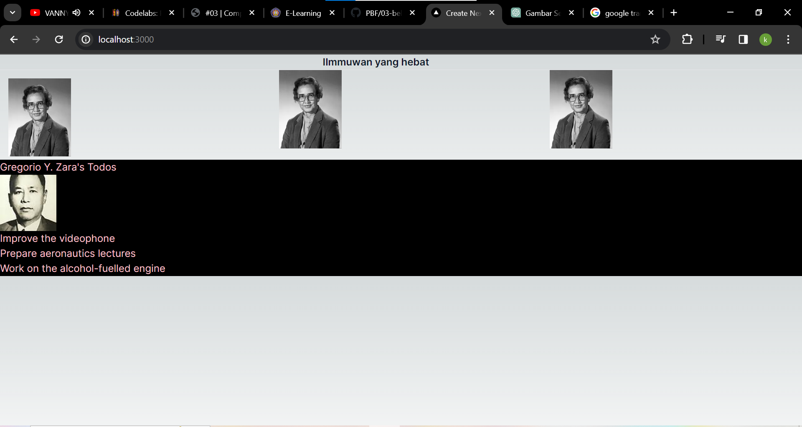

### **Soal 1.** Ubah isi kode Home() sehingga dapat tampil seperti berikut dengan memanfaatkan komponen Profile() yang tadi sudah dibuat dari langkah 1 tersebut!


Capture hasilnya dan buatlah laporan di README.md. Jelaskan apa yang telah Anda pelajari dan bagaimana Anda solve error tersebut?

Jangan lupa push dengan pesan commit: "W03: Jawaban soal 1".

Jawab: 

```

```
### **Soal 2. Capture hasilnya dan buatlah laporan di README.md. Jelaskan apa yang telah Anda pelajari dan bagaimana tampilannya saat ini?**
jawab : 
komponen ini bertujuan untuk menampilkan beberapa instance dari komponen (Profile) dalam bentuk grid dengan 3 kolom.
berbeda dengan soal sebelumnya ialah hanya memanggil 1 kali.


## **Soal 3. Silakan perbaiki kode JSX berikut ini. Anda boleh menggunakan konverter atau perbaiki secara manual.**
jawab : 

```
karena aturan untuk kode jsx tersebut ialah menggunakan "className" bukan menggunakan class dan kode tersebut harus dibungkus dengan <div> <main> 
```
## **Soal 4. Kode di atas masih terdapat error, silakan diperbaiki.**
jawab : 

```
untuk kode yang error yang sebelumnya adalah menambahkan import react from 'react'
mengubah {person} menjadi {person.name} untuk menampilkan nama orang bukan tema
mengubah src gambar menjadi 'https://i.imgur.com/7vQD0fP.jpg' karena link gambar salah
```

## **Soal 5. Buka file src/components/todolist.tsx lakukan ekstrak URL gambar ke dalam objek person. Capture hasilnya dan buatlah laporan di README.md. Apakah ada perbedaan pada tampilan web saat ini?**
jawab :

```
Dalam kode yang diperbaiki, URL gambar dibuat secara dinamis menggunakan properti imageId dan imageSize dari objek person, dan kemudian digunakan dalam elemen . Sekarang kode tersebut sudah benar dan akan menggunakan URL gambar yang sesuai dengan data dari objek person.
```

## **Soal 6. Perbaiki kode tersebut pada bagian atribut src. Kode lainnya dapat Anda sesuaikan dari jawaban soal sebelumnya. Capture hasilnya dan buatlah laporan di README.md. Jelaskan apa yang telah Anda pelajari dan bagaimana tampilannya saat ini?**
Jawab : 
Sebelum diperbaiki

Setelah Diperbaiki

```
Dengan menggunakan tanda kutip kembali () dan mengapit seluruh ekspresi dengan tanda kurung kurawal, memastikan bahwa tag tersebut dievaluasi sebagai bagian dari string yang sesuai untuk atribut src`. Dengan demikian, URL gambar akan dihasilkan dengan benar saat komponen diproses.

```